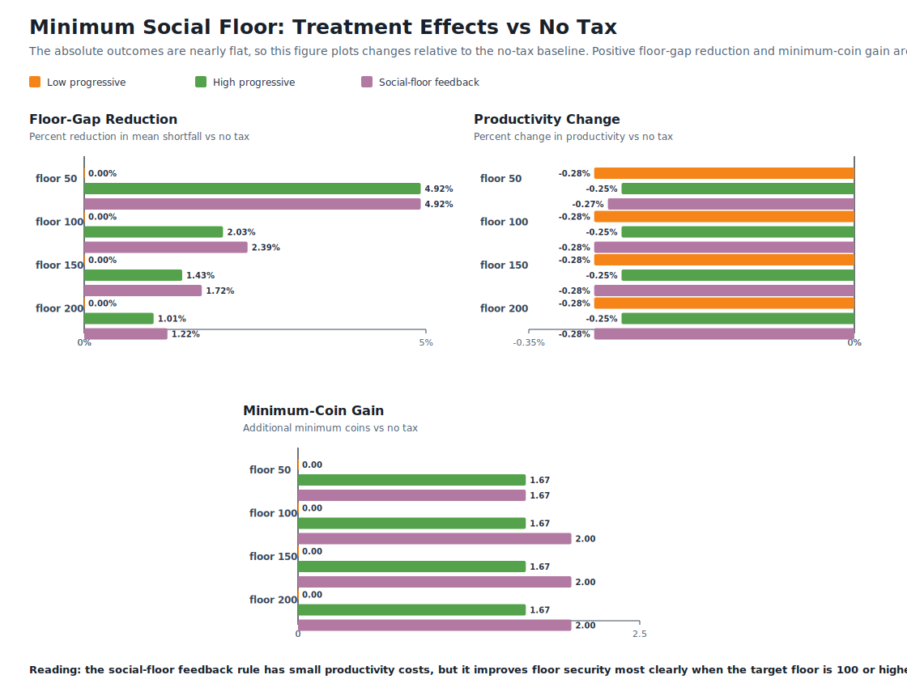

# Institutional Objectives in AI Economist-Style Simulations

This fork extends EconoJax to test **minimum social floor** objectives in an
AI Economist-style simulation.

The central question is not whether artificial planners can make agents equal.
The question is whether institutional rules can prevent agents from falling
below a minimum economic security threshold while preserving productivity.

The first experiment compares explicit tax-and-transfer rules:

```bash
python experiments/social_floor_policy_comparison.py
```

Results are written to:

```text
results/social_floor_policy_comparison.csv
```

This is an early laboratory baseline, not a trained AI planner. The next step is
to train a PPO government agent using the social-floor objective and compare the
learned policy against the deterministic baselines.

## Initial Sensitivity Result

The sensitivity experiment evaluates social floor thresholds of `50`, `100`,
`150`, and `200` coins:

```bash
python experiments/social_floor_sensitivity.py
```

Across these thresholds, the `social_floor_feedback` rule provides the best
floor security for floors `100`, `150`, and `200`, while `no_tax` preserves
slightly higher productivity.

Because the absolute outcome levels are very close across policies, the figure
below plots treatment effects relative to the `no_tax` baseline. This makes the
small tradeoff visible: floor-oriented policies modestly reduce shortfalls and
raise the minimum model money supply level, but they also carry a small
productivity cost.



| Social floor | Best floor-gap policy | Mean floor gap | Best productivity policy | Mean productivity |
| --- | --- | ---: | --- | ---: |
| 50 | high_progressive_tax | 17.167 | no_tax | 377.278 |
| 100 | social_floor_feedback | 45.389 | no_tax | 377.278 |
| 150 | social_floor_feedback | 76.194 | no_tax | 377.278 |
| 200 | social_floor_feedback | 108.139 | no_tax | 377.278 |

Interpretation: the deterministic feedback rule modestly improves the minimum
social floor metric, but the effect is not large. The result should be treated
as a falsifiable baseline for future learned-planner experiments, not as a
policy conclusion.

To regenerate the figure from the sensitivity summary:

```bash
python experiments/generate_figures.py
```

---

# EconoJax: A Fast & Scalable Economic Simulation in JAX

[](https://www.python.org/)

EconoJax is (loosely) a reimplementation of [The AI Economist](https://www.science.org/doi/10.1126/sciadv.abk2607) in JAX with a 1D observation space rather than the original 2D visual space.
With GPU support, EconoJax's transition function is over 100x times faster and agents converge over **2000x** times faster.

---

## 📦 Installation

For those using [uv](https://docs.astral.sh/uv/getting-started/installation/), it is possible to run a standard PPO implementation with default settings by directly running `uv run main.py`.

```bash
git clone git@github.com:ponseko/econojax.git
cd econojax
uv run main.py
```

Alternatively, install the project as an editable package in your favourite virtual environment software. E.g. using conda:

```bash
git clone git@github.com:ponseko/econojax.git
cd econojax
conda create -n econojax python=3.11
conda activate econojax
pip install -e .

python main.py
```

for CUDA support, additionally run `pip install jax[cuda]`.

---

## 📑 Citing

If you use EconoJax in your research or projects, please cite:

```bibtex
@article{ponse2024econojax,
  title={EconoJax: A Fast \& Scalable Economic Simulation in Jax},
  author={Ponse, Koen and Plaat, Aske and van Stein, Niki and Moerland, Thomas M},
  journal={arXiv preprint arXiv:2410.22165},
  year={2024}
}
```
